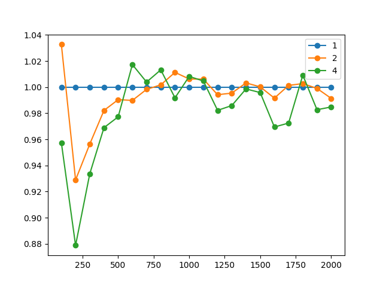

# Решение СЛАУ методом Якоби с помощью MPI

### Задача
[СЛАУ](https://ru.wikipedia.org/wiki/Система_линейных_алгебраических_уравнений)
представима в матричной форме как A[n×n] × x[n×1] = b[n×1]. Даны A и b, необходимо
найти x с заданной точностью ε.

[Метод Якоби](https://ru.wikipedia.org/wiki/Метод_Якоби) — это итерационный метод.
На каждой итерации находятся новые значения вектора x исходя из значений элементов
матриц A и b и значений вектора x, найденных на предыдущем шаге.

Достаточное условие сходимости метода Якоби: `∥B∥ < 1`. Сходимость и решение
не зависят от начального приближения x0. При `∥B∥ < 0.5` условие окончания итераций
принимает вид: `maxᵢ |xᵢ(текущее) - xᵢ(старое)| < ε`.

Выполнить условие сходимости метода Якоби позволяет обеспечение диагонального
преобладания матрицы A.

### Параллельный алгоритм
1. Каждый из процессов получает параметры задачи: n, ε, A, b, x0. Главный процесс
определяет области искомого вектора x, за вычисление которых будет ответственен 
каждый из процессов, и рассылает (offset, size).
1. На каждой итерации каждый из процессов вычисляет свою часть вектора x. Затем
он рассылает данную часть всем остальным процессам (синхронизация). После
выполнения данного шага все процессы будут иметь новую версию вектора x.
1. Итерирование завершается при достижении условия окончания (при достижении
необходимой точности).

### Результаты измерений

На исследованных размерах СЛАУ паралельный алгоритм не даёт выигрыша.
