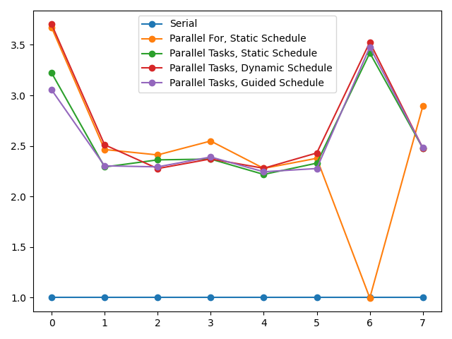

# Параллельное умножение матриц с помощью OpenMP

[Описание OpenMP](http://ccfit.nsu.ru/arom/data/openmp.pdf)

### Задача
Выполнить умножение матриц: A[a×b] × B[b×c] = C[a×c]

Для экспериментов будем задавать различные размеры [a×c], величина b пусть будет
константой равной 500.

### Последовательное решение (Serial)
Последовательное решение представляет собой два вложенных цикла for, вычисляющие
каждый из элементов матрицы C. Вычисление элемента матрицы C - это цикл, вычисляющий
сумму произведений соответствующих элементов матриц A и B. 

### Параллельное решение

##### Parallel For, Static Schedule
Возьмём последовательное решение и распараллелим внешний цикл for. Таким образом,
получим число задач, равное количеству строк матрицы C, которые поровну
распределяются по процессорам.

Разные потоки считывают элементы матриц A и B, находящихся в куче. Результат
вычислений записывается в матрицу C, каждый поток работает только со своей строкой
матрицы C. Следовательно, не требуется синхронизировать потоки или собирать
данные между потоками.

При данном решении если количество строк матрицы C меньше числа процессоров,
не все процессоры будут загружены. На графике видно, что для размера матрицы 6
(1×1,000,000) данная реализация не даёт ускорения.

##### Parallel Tasks
Теперь задачей будет вычисление каждого из элементов матрицы C. Так утилизация
процессоров будет эффективнее. Каждый поток по-прежнему будет писать только
в свою область памяти.

Существуют различные режимы распределения задач по потокам:
* static - поровну
* dynamic - пакетами фиксированного размера
* guided - пакетами меняющегося размера

Режимы dynamic и guided позволяют балансировать нагрузку и эффективнее
утилизировать процессоры, если задачи различаются по времени выполнения.
В задаче умножения матриц вычисление каждого из элементов матрицы C содержит
одинаковое количество операций (O(b)). Следовательно, наиболее эфективным будет
режим распределения задач static, распределяющий задачи поровну и не вносящий
накладных расходов. На практике, как видно из графика, ускорения при различных
режимах распределения примерно одинаковые.

### График ускорений
На графике показаны ускорения вычисления задачи для различных параллельных
реализаций относительно последовательного решения. На горизонтальной оси числами
0-7 пронумерованы различные размеры матриц.

### Вывод
Наиболее эффективный метод - распределение задач вычисления каждого из элементов
результирующей матрицы поровну между потоками. На 4 CPU удалось достичь ускорения
от 2.5 до 3.5.
