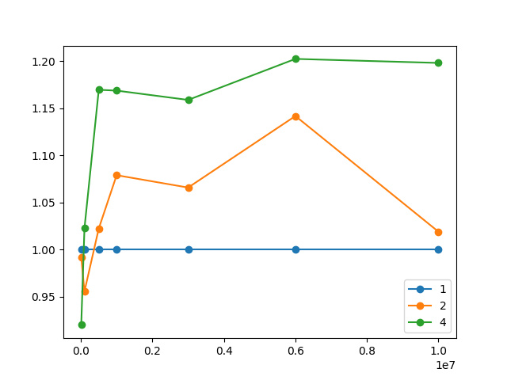
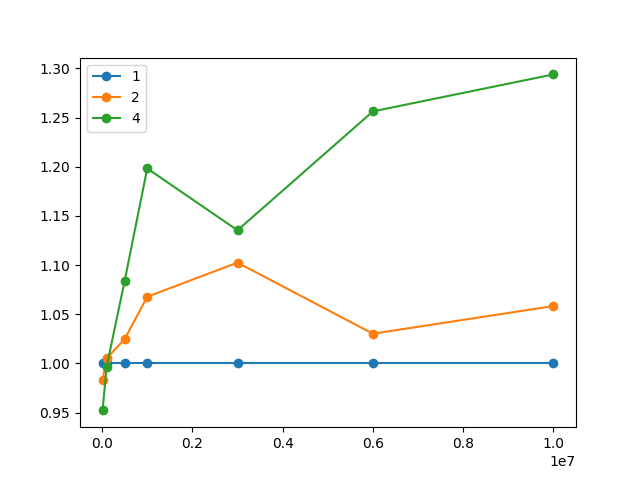

# Parallel Quicksort с помощью MPI

[Send and Receive](https://mpitutorial.com/tutorials/mpi-send-and-receive/)

## Запуск
Установить реализацию MPI

`apt install mpich`

Запуск на одной машине

`mpiexec -n <totalProcesses> ./quicksort`

Запуск на кластере. Узлы должны быть доступны друг другу по ssh
и иметь одинаковую файловую структуру

`mpiexec --host <host1,host2...> -n <totalProcesses> ./quicksort`

## Алгоритм параллельного quicksort

* Среди всех процессов выбирается главный с рангом `PRIMARY_PROCESS = 0`. Главный
процесс кроме непосредственных вычислений будет также управлять остальными
процессами.
* В ходе алгоритма процессы объединяются в группы (`class ProcessGroup`).
В каждой группе выбирается один `master`-процесс. Группа имеет чётное количество
процессов, которые будут рекурсивно разделены на две половины/подгруппы (левую и
правую). Каждый процесс в группе имеет партнёра — процесс, с которым данный процесс
будет обмениваться частями массива. Процесс из левой половины имеет партнёра в
правой и наоборот. Исходя из этого общее число процессов должно быть степенью
двойки (1, 2, 4...).
* Процессы обмениваются между собой данными. Все операции отправки данных
асинхронные, все операции получения данных синхронные. Каждая пересылка помечена
тегом, соответствующим этапу алгоритма.
<table>
    <tr><th>Тег</th><th>Этап алгоритма</th></tr>
    <tr><td>0</td><td>INITIALIZE (1)</td></tr>
    <tr><td>1</td><td>PIVOT (2)</td></tr>
    <tr><td>2</td><td>EXCHANGE (3)</td></tr>
    <tr><td>3</td><td>REGROUP (4)</td></tr>
    <tr><td>4</td><td>COLLECT (6)</td></tr>
</table>

1. Главный процесс считывает массив из файла и распределяет между всеми процессами,
разбив на примерно одинаковые части. Все процессы принимают свою часть. Изначально
все процессы находятся в одной общей группе.
1. В каждой из групп master-процесс выбирает опорный элемент (PIVOT) и сообщает его
всем участникам группы.
1. Каждый процесс выполняет разбиение Хоара и получает две части массива:
low (элементы <= PIVOT) и high (элементы >= PIVOT). В каждой из групп
процессы-партнёры обмениваются соответствующими частями массивов так, чтобы
в пределах одной группы в левой половине все элементы были меньше опорного
элемента, а в правой — больше.
1. Master выполняет перегруппировку, левая и правая половины группы становятся
самостоятельными группами. Алгоритм переходит к шагу 2 и продолжается пока все
группы не будут состоять из одного процесса.
1. Когда в каждой группе остался единственный процесс, он выполняет сортировку
своей части массива стандартной функцией qsort.
1. Главный процесс собирает отсортированные части массива со всех процессов
и объединяет их в один массив в порядке возрастания номеров процессов.

## Измерение времени вычисления

Важная часть данной сортировки — равномерное распределение вычислительных задач
по процессам. Для этого необходимо стремиться разбивать массив каждого процесса
на две как можно более равные части с помощью выбора опорного элемента. Медиана
всех элементов массива является оптимальным опорным элементом, но её вычисление
слишком затратно. Протестированы два метода выбора опорного элемента: первый
элемент массива (pivot-first) и медиана первого, среднего и последнего элементов
(pivot-median). 

Время сортировки массива (в секундах) размером 10 млн для разных методов
и количества процессов

|Метод       |  1 |  2 |  4 |
|------------|----|----|----|
|pivot-first |4.44|4.35|3.70|
|pivot-median|4.43|4.18|3.42|

### Графики ускорения

#### Опорный элемент — первый

#### Опорный элемент — медианный из первого, среднего и последнего

