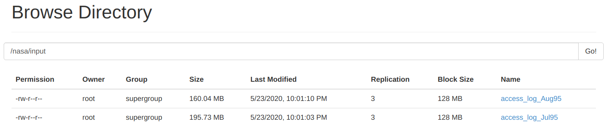
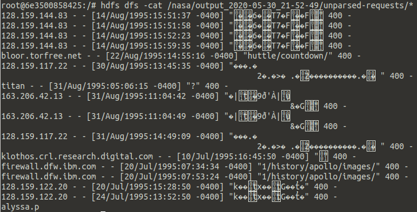
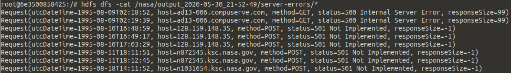
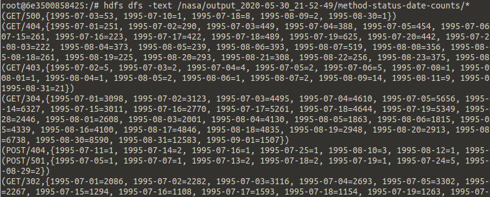
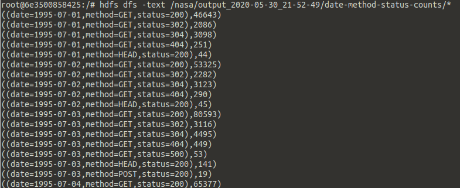
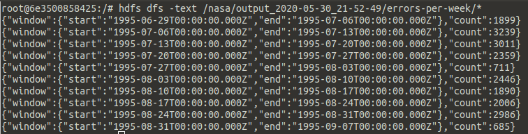

# Обработка логов с помощью Spark + Hadoop

## Подготовка
1. Сконфигурируем развёртывание Spark + Hadoop кластера в docker-compose.yml

1. Положим логи в папку на HDFS с помощью команд `hdfs dfs -mkdir -p /nasa/input` и
`hdfs dfs -put * /nasa/input`. При чтении директории из Спарка содержимое файлов
объединится.

1. Скрипт deploy-app.sh будет компилировать и запускать приложение

## Программа на Спарке
1. Считаем входную директорию с логами и попытаемся представить каждую строку в
виде объекта класса Request. Сохраним строки, которые не удалось распарсить.

1. Имея RDD\<Request>, выберем запросы, завершившиеся ошибкой сервера (код 5xx).
Количество таких запросов выведем в логах = 106.

1. Задание "Подготовить временной ряд количества запросов для всех комбинаций
методов и статусов" можно решить по-разному в зависимости от желаемого
представления результатов.

    1. Представление { (method, status, date) → count },
    класс `MethodStatusDateCounter`
    

    1. Представление { (date, method, status) → count },
    класс `DateMethodStatusCounter`
    

1. Найдём суммарное количество ошибок (коды 4xx и 5xx) по семидневным интервалам

